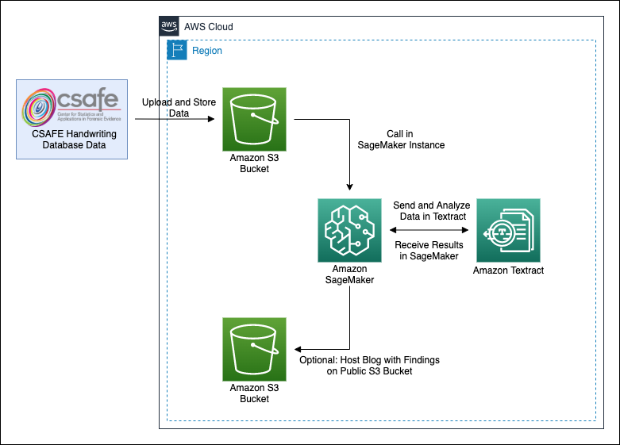

# Evaluating AWS Textract
By: Hannah Marcus, Anjanay Nangia, Andrew Taber, Landon Warner, and Ben Zhao
### Link to Blog with Full Description:

Hi, welcome to our walkthrough on testing the accuracy of AWS Textract based on various factors.

Textract is an Amazon Web Services Machine Learning service that can extract text, handwriting, and even data from uploaded images and documents. Access the full documentation [here](https://docs.aws.amazon.com/textract/).

As described in the blog, we extract data hosted in an AWS S3 Bucket to AWS SageMaker and send it to AWS Textract for analysis. After receiving our results in SageMaker, we perform statistical tests using Python to assess how various variables impact Textract's abilities. To perform similar testing, see the section on replication below. 

## **Architecture**

Starting with data from the CSAFE Handwriting Database, the user stores the data in an Amazon AWS S3 Bucket. Then, using Amazon SageMaker, the user pulls the data from their created bucket. Using SageMaker, the user can send the data to be analyzed and returned by Amazon Textract. At this point, with results in their SageMaker instance, a user can look at their results and run tests with everything readily hosted in the AWS Cloud. Importantly, the data itself is never actually *in* SageMaker, but is directed from SageMaker to Textract through code in SageMaker. Finally, our blog post is readily available through a publicly hosted AWS S3 Bucket.

## **Replicating our Work**

**Optional:** To get a better idea of the data we are working with, feel free to open the 'explore_handwriting_sample.ipynb'. In that notebook, there is an interactive tool to show you a few of the handwriting samples that are stored in our S3 Bucket. This is not necessary for replication, but it helps you to understand what is going on behind the scenes.

1) The first step in replicating our work can be found in the 'textract_response_gen.ipynb' file. All CSAFE handwriting samples have been uploaded to our S3 bucket and in that notebook you will query Textract with files from that bucket in order to generate a list of Textract responses for each file. We recommend only querying a few files to test it because sending all 3754 files takes hours. Once this step is complete, you will have the response JSON objects in your directory for cleaning.

2) Next, we must clean the data in our data_cleaning.ipynb notebook. Again, we recommend just using the 'response1.json' and 'response2.json' files found in the repo for simplicity's sake. This notebook will walk you through our steps to clean the file and get it ready for analysis. After running this notebook, you will have generated a file called 'textract_dataframe.csv' which is good to go for analysis.

3) Finally, we must perform our analysis. This can be done by running the cells in our data analysis notebook.

*As an important note, all packages used in the notebooks will need to be installed by the User to run properly*

## **Further Experimentation**

Feel free to perform any further analysis on our data that you desire. Our investigation analyzed the most significant variables, but there are more to check out in the dataset.

